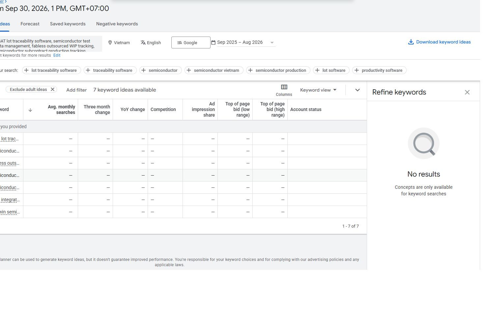
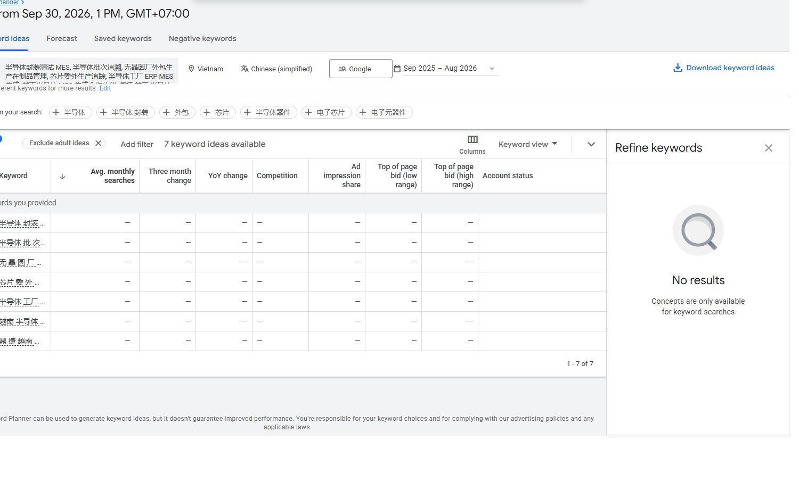
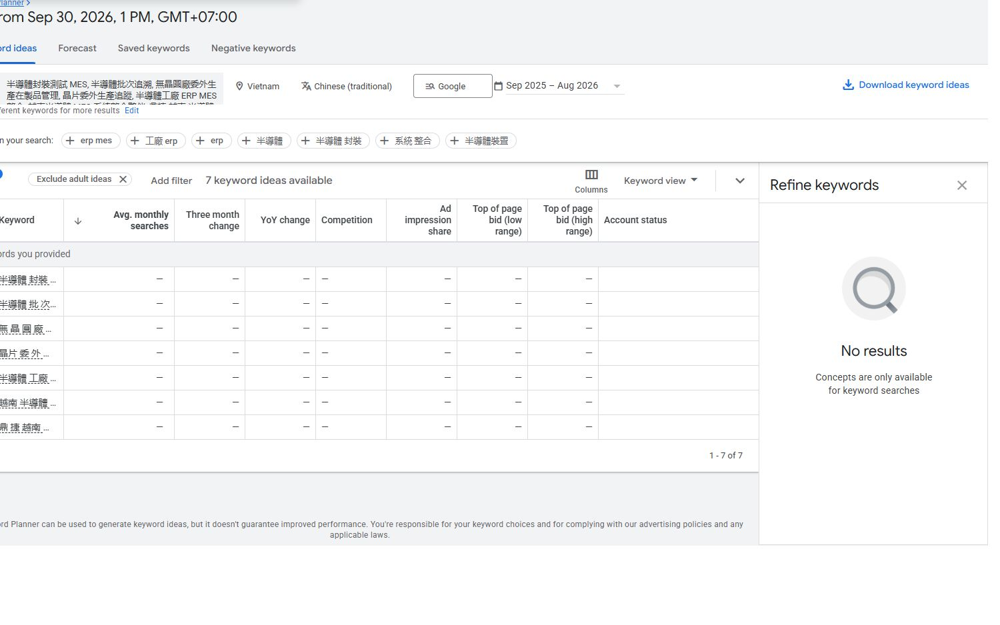

# Ảnh bằng chứng · 30/09/2026

Ba ảnh chụp giao diện Planner có sẵn trong repo. [Biên bản và seed đầy đủ](03_Ngan_sach_va_do_luong/06_Planner_EN_Chinese_Bien_ban_2026-09-30.txt).

## Keyword Planner · English

Ảnh chụp 30/09/2026, khoảng 13:54 UTC+7. Bộ lọc hiển thị: Việt Nam, English, Google, Sep 2025–Aug 2026. Bảy dòng từ khóa có dấu gạch ngang ở các cột chỉ số. Đây là kết quả của cấu hình truy vấn này; không suy nhu cầu bằng 0, CPC hoặc hiệu quả quảng cáo. Mép trái ảnh gốc cắt một phần tên từ khóa; đọc bảng seed trong biên bản kèm theo.

## Keyword Planner · Chinese (simplified)

Ảnh chụp 30/09/2026, khoảng 13:57 UTC+7. Bộ lọc hiển thị: Việt Nam, Chinese (simplified), Google, Sep 2025–Aug 2026. Bảy dòng từ khóa có dấu gạch ngang ở các cột chỉ số. Đây là kết quả của cấu hình truy vấn này; không suy nhu cầu bằng 0, CPC hoặc hiệu quả quảng cáo. Mép trái ảnh gốc cắt một phần tên từ khóa; đọc bảng seed trong biên bản kèm theo.

## Keyword Planner · Chinese (traditional)

Ảnh chụp 30/09/2026, khoảng 13:59 UTC+7. Bộ lọc hiển thị: Việt Nam, Chinese (traditional), Google, Sep 2025–Aug 2026. Bảy dòng từ khóa có dấu gạch ngang ở các cột chỉ số. Đây là kết quả của cấu hình truy vấn này; không suy nhu cầu bằng 0, CPC hoặc hiệu quả quảng cáo. Mép trái ảnh gốc cắt một phần tên từ khóa; đọc bảng seed trong biên bản kèm theo.

Ảnh LinkedIn của tệp chính/backup và bộ lọc có thông tin tài khoản. Bản đầy đủ được gom riêng trên máy ở `D:/LinkedIn_Package_V2_Evidence_2026-10-08/`, không nằm trong Git. Ba ảnh ở nhóm 06 chỉ để đối chiếu bản trình bày package.
