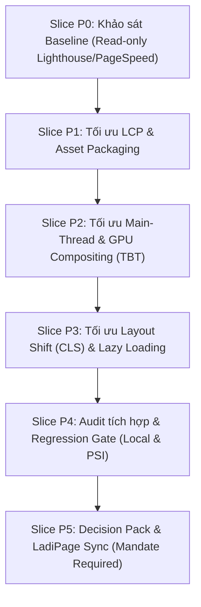

# Kế hoạch khảo sát và tối ưu hiệu năng PageSpeed cho 3 Landing Page Semiconductor

**Trạng thái đóng băng (2026-09-29):** P0–P3 và candidate local P4 đã hoàn tất trong phạm vi tối ưu nguồn đã được duyệt. Commit local `eb88b8e` được Publish lên cả ba URL LadiPage hiện hữu. Lighthouse 13.5.0 trên production đo hai lượt Mobile: OSAT **57/53**, Fabless **48/58**, Partner **49/54**; Desktop **88/87/86**. Mobile không đạt ngưỡng kỹ thuật 80, vì vậy **không ghi P4/P5 là performance PASS**. Bảo quyết định **partial acceptance**: chấp nhận bản live hiện tại vì các tối ưu nguồn trong scope đã được khai thác và Mobile không phải ưu tiên chính; đóng P4 audit và P5 Decision Pack/Deploy theo ngoại lệ này, đóng băng thêm tối ưu PageSpeed trong scope hiện tại. Quyết định, bằng chứng và phần còn mở nằm ở `operations/evidence/performance/2026-09-29-p4-p5-partial-acceptance-closeout.md`. Lighthouse CLI là phép đo lab trên URL live, chưa phải kết quả PSI độc lập.
**Tiêu chuẩn đánh giá:** [Google PageSpeed Insights](https://pagespeed.web.dev/) (chuẩn canonical được công nhận tại Digiwin).  
**Mục tiêu định lượng:** Điểm hiệu năng (Performance Score) đạt **tối thiểu 80+** trên cả **Desktop** và **Mobile** cho 3 route:
1. OSAT: `https://solutions.digiwin.com.vn/semiconductor-osat`
2. Fabless: `https://solutions.digiwin.com.vn/fabless`
3. Supplier / Partner: `https://solutions.digiwin.com.vn/supplierecosystem`

---

## 1. Ranh giới bảo vệ bất biến (Protected Invariants & Non-negotiables)

Theo quy chế vận hành `AGENTS.md` và các phase đã nghiệm thu:
1. **Bảo toàn đo lường (Measurement Invariant):**
   * Giữ nguyên container GTM `GTM-NGT54TM9` (Version 51) và GA4 Destination `G-20TL63SYLQ`.
   * Giữ nguyên logic runtime tracking micro-events: `section_view` và `section_engagement_time` (với center-band intersection, visible+focused timing, pagehide flush).
   * Cấm xóa các attribute hoặc element ID phục vụ section observer (`#top`, `#operations-questions`, `#lot-map`, `#cas-ic-case`, v.v.).
2. **Bảo toàn chuyển đổi & Form (Conversion Invariant):**
   * Số lượng và ID CTA không đổi: OSAT (2: `osat-cta-header`, `osat-cta-terminal`), Fabless (2: `fabless-cta-header`, `fabless-cta-terminal`), Partner (duy nhất 1: `partner-cta-header` với label `Tư Vấn`).
   * Giữ nguyên PopupX bridge contract (`actionPopupX` qua `data-ldp-native-form-popup-trigger`), giữ nguyên 4 trường hiển thị (`name`, `email`, `phone`, `industry`).
   * Tuyệt đối không nhúng form thô vào HTML canonical, không tự gửi lead thật.
3. **Bảo toàn nội dung & Nhận diện thương hiệu (Visual & Content Integrity):**
   * Không xóa bỏ các bằng chứng (proof), nguồn dẫn (citations) hoặc cấu trúc nội dung đã được duyệt.
   * Giữ nguyên ngôn ngữ thiết kế Lumia/Digiwin Dark Glassmorphism trên desktop; không làm biến dạng giao diện desktop đã duyệt.
4. **Quy trình triển khai (Deployment Boundary):**
   * Mọi tối ưu hóa mã nguồn được thực hiện trên branch `slice/landing-pagespeed-optimization`.
   * Chỉ cập nhật lên LadiPage live khi có Decision Pack được Bảo phê duyệt và tuân thủ chặt chẽ contract `revise_existing_page` của `$ladipage-operator`.

---

## 2. Nhận diện các điểm nghẽn hiệu năng tiềm ẩn (Hypothesized Bottlenecks)

Dựa trên phân tích mã nguồn HTML hiện tại (~220KB - 260KB/trang):

| Nhóm yếu tố | Hiện trạng quan sát trong mã nguồn | Tác động Core Web Vitals |
|---|---|---|
| **LCP (Largest Contentful Paint)** | • Ảnh Hero dùng background-image từ `lh3.googleusercontent.com` chưa tối ưu định dạng (chưa dùng WebP/AVIF). • Thiếu thẻ `<link rel="preload">` và thuộc tính `fetchpriority="high"` cho ảnh LCP. • Tài nguyên ảnh render phụ thuộc mạng ngoài. | **LCP > 4.0s (Kém)** trên Mobile do nghẽn tải ảnh lớn lúc khởi tạo. |
| **TBT (Total Blocking Time)** | • Nhiều inline SVG filter `feTurbulence` data URI (noise texture) áp dụng trên các lớp glassmorphism có `backdrop-filter: blur(24px)`. • CSS keyframe animations chạy liên tục (`marquee-scroll`, `vaultLumenSpin`, `@property --vault-angle`). • Third-party scripts (GTM, GA4, PopupX SDK) cạnh tranh tài nguyên Main Thread lúc load. | **TBT > 600ms (Kém)** trên Mobile do CPU bị throttle 4x-6x, GPU tiêu tốn tài nguyên rasterization liên tục. |
| **CLS (Cumulative Layout Shift)** | • Một số thẻ `` chưa có tỷ lệ cố định hoặc placeholder lúc chờ ảnh tải. • Phông chữ `"Be Vietnam Pro"` tải ngoài có thể gây FOUT (Flash of Unstyled Text) nếu thiếu font metric matching. | **CLS > 0.1** gây giật khung hình khi tải chậm trên mạng 4G/3G. |
| **FCP & DOM Size** | • Khối CSS inline khổng lồ (~100KB-120KB CSS inline trong mỗi file HTML) chặn render. • DOM tree > 4,000 dòng HTML trên mỗi trang vượt ngưỡng khuyến nghị của Lighthouse (> 1,400 DOM nodes). | **FCP > 2.5s**, làm chậm quá trình parse cây DOM và render ban đầu. |

---

## 3. Chiến lược tối ưu hóa kỹ thuật (Technical Optimization Levers)

Để đạt mục tiêu **PageSpeed >= 80** cho cả Mobile và Desktop:

### 3.1. Tối ưu LCP (Largest Contentful Paint)
1. **Preload & Fetch Priority:**
   * Xác định chính xác LCP element của từng route (Desktop và Mobile).
   * Khai báo `<link rel="preload" as="image" href="..." fetchpriority="high">` ở `<head>` cho LCP image.
2. **Tối ưu định dạng và kích thước ảnh:**
   * Áp dụng skill `bundle-asset` để nén các ảnh hero và diagram sang định dạng WebP/AVIF thế hệ mới.
   * Cung cấp các mức kích thước responsive: Mobile (chiều rộng tối đa 480px-750px), Desktop (1200px-1600px) thay vì dùng chung ảnh gốc độ phân giải cao.
3. **Lazy-loading toàn diện below-the-fold:**
   * Đảm bảo 100% hình ảnh nằm ngoài viewport đầu tiên có thuộc tính `loading="lazy"` và `decoding="async"`.

### 3.2. Tối ưu TBT (Total Blocking Time) & CPU Compositing
1. **Tối ưu hóa Noise Filter & Hiệu ứng đồ họa:**
   * Thay thế inline SVG `feTurbulence` data URI nặng nề trên mobile bằng CSS gradient noise nhẹ hoặc vô hiệu hóa bộ lọc CPU-heavy trên màn hình nhỏ (`@media (max-width: 768px)`).
   * Sử dụng `will-change` có chừng mực và thêm thuộc tính `content-visibility: auto` cho các section phía dưới chân trang để trình duyệt hoãn render layout các section chưa cuộn tới.
2. **Tối ưu hoạt cảnh (Animations):**
   * Tạm dừng hoặc giảm nhẹ các animation lặp vô tận (như conic-gradient revolving, marquee) khi ở trạng thái ngầm hoặc trên mobile để giải phóng CPU cycle.
3. **Quản lý Third-party Scripts:**
   * Đảm bảo GTM container và PopupX SDK được nạp với chiến lược `async`/`defer` phù hợp, không chặn quá trình hydrate và first render của trang.

### 3.3. Tối ưu CLS (Cumulative Layout Shift) & Web Fonts
1. **Cố định kích thước khung hình:**
   * Mọi thẻ `` và SVG container bắt buộc phải khai báo đầy đủ `width`, `height` hoặc `aspect-ratio` trong CSS để trình duyệt tính toán trước bounding box.
2. **Tối ưu Web Fonts:**
   * Bổ sung `font-display: swap` cho font khai báo.
   * Khai báo font stack dự phòng chính xác (`system-ui`, `-apple-system`, `sans-serif`) để tránh xê dịch layout khi web font hoàn tất tải.

---

## 4. Lộ trình thực thi theo Slices (Execution Slices)

| Slice | Mục tiêu & Hành động chính | Input / Quyền ghi | Acceptance / Cổng nghiệm thu |
|---|---|---|---|
| **P0: Khảo sát Baseline** | Chạy kiểm tra PageSpeed Insights cho cả 3 URL public live (`/semiconductor-osat`, `/fabless`, `/supplierecosystem`) trên cả Mobile và Desktop. Thu thập điểm số và danh sách audit metrics chi tiết. | Public URLs *Read-only* | Bảng dữ liệu Baseline đầy đủ: Điểm tổng, LCP, TBT, CLS, FCP, Speed Index, danh sách Top Opportunities. |
| **P1: Tối ưu LCP & Media** | Nén WebP/AVIF, phân tách kích thước ảnh theo breakpoint, thêm preload/fetchpriority cho ảnh LCP. Áp dụng vào 3 file HTML canonical. | P0 Report *Ghi: 3 file HTML canonical* | LCP element tải nhanh hơn rõ rệt; không làm vỡ tỉ lệ hoặc giảm chất lượng hiển thị hero card. |
| **P2: Tối ưu TBT & CSS/JS** | Tối ưu SVG noise filter, giảm tải backdrop-filter trên mobile, thêm `content-visibility: auto`, tinh gọn CSS thừa. | P1 Candidate *Ghi: 3 file HTML canonical* | TBT trên mobile giảm dưới 300ms; không làm hỏng visual dark glassmorphism trên desktop. |
| **P3: Tối ưu CLS & Load** | Khai báo cứng aspect-ratio/width-height cho toàn bộ media, cấu hình font fallback, lazy loading triệt để. | P2 Candidate *Ghi: 3 file HTML canonical* | CLS đạt mức lý tưởng (< 0.05) trên cả 2 thiết bị. |
| **P4: Audit & Regression** | • Chạy `node --test tests/landing-tracking.test.cjs`. • Kiểm tra PopupX bridge handoff. • Chạy Lighthouse local/PSI đo lại điểm số. | P3 Candidate *Read-only Audit* | 12/12 tracking tests PASS; các kiểm tra live CTA/PopupX/GTM và hai lượt Mobile đã thực hiện. Ngưỡng Mobile >=80 **FAIL**; Bảo chấp nhận một phần và đóng audit theo ngoại lệ, không đổi kết quả đo thành PASS. |
| **P5: Decision Pack & Deploy** | Lập báo cáo kết quả trước/sau gửi Bảo duyệt. Khi có mandate, áp dụng `$ladipage-operator` qua receipt `revise_existing_page` để cập nhật LadiPage. | Bằng chứng P4 và mandate của Bảo | Ba trang đã Publish tại URL cũ và kiểm tra live. Desktop >=80; Mobile <80 được Bảo chấp nhận một phần. P5 đóng theo ngoại lệ kinh doanh; receipt LadiPage vẫn PENDING cho đến khi có closeout bằng chứng riêng. |

---

## 5. Bước tiếp theo

1. Freeze bản production ở revision P4 `eb88b8e`; không tiếp tục vòng tối ưu PageSpeed trong scope P4/P5 hiện tại. Giữ nguyên các phép đo Mobile dưới 80 làm bằng chứng, không đổi ngưỡng kỹ thuật.
2. Ba receipt `revise_existing_page` của lần deploy vẫn PENDING. Chỉ đánh dấu COMPLETED sau khi đủ đối chiếu canonical/Builder/public desktop-mobile và validator closeout; quyết định partial acceptance không thay thế bằng chứng kỹ thuật của receipt.
3. Công việc PageSpeed mới, thay đổi ngưỡng, republish, hoặc thay đổi hạ tầng live cần một scope và mandate mới của Bảo. Tracking Phase 5 đã đóng trước đó là một luồng riêng, không bị đổi terminal bởi quyết định PageSpeed này.
