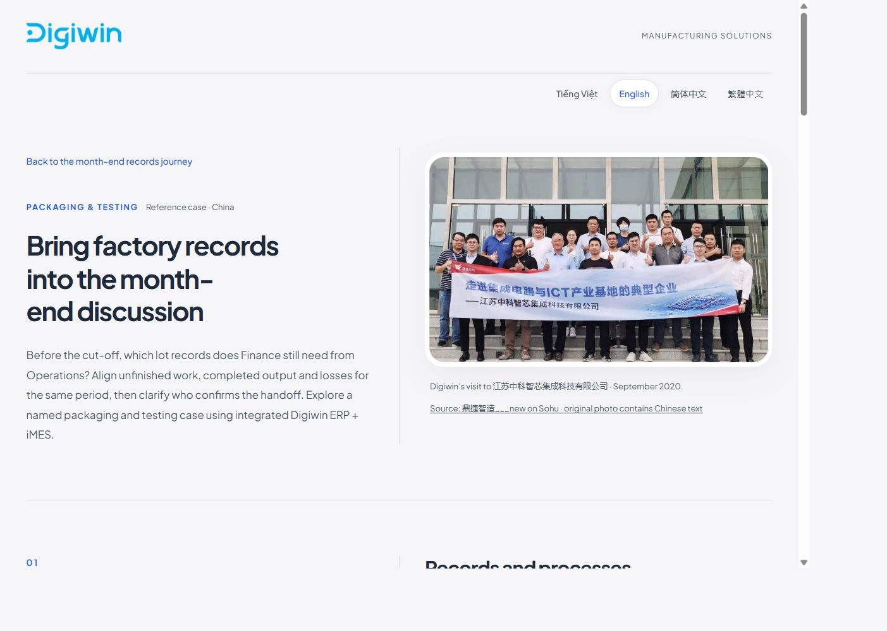

# O3 destination HTML review · 2026-10-07

SUCCESS / SCOPED_SELF_REVIEW_COMPLETE / PO_PENDING. Root built and reviewed these revisions; no independent/native-market audit claimed. [Revision-bound MSG-ANCHOR receipt](review-receipt.json) contains exact per-unit/per-locale observations, current journey text and transition review, source/HTML/copy/evidence hashes and protected-file checks.

| Journey | Initial locale | Revised reader |
|---|---|---|
| O3 candidate1-v4 | English | [HTML](../../../../deliverables/linkedin-locale-dogfood/2026-10-06/en-osat-candidate1-v4/case-reader.html?lang=en) |
| O3 candidate2-v2 | Simplified Chinese | [HTML](../../../../deliverables/linkedin-locale-dogfood/2026-10-06/zh-Hans-osat-candidate2-v2/case-reader.html?lang=zh-Hans) |
| O3 candidate3-v1 | Traditional Chinese | [HTML](../../../../deliverables/linkedin-locale-dogfood/2026-10-06/zh-Hant-osat-candidate3-v1/case-reader.html?lang=zh-Hant) |

Each reader includes vi/en/zh-Hans/zh-Hant with inline assets, VN Soft Structuralism + Editorial Split, original exact-case Digiwin visit photo and translated historical caption/source/alt. Current O3 framing is Operations-led month-end records preparation with Finance: unfinished work by lot/cutoff, output/scrap/loss for the same period and confirmation/handoff ownership. The named China integrated ERP+iMES result is month-close duration15days→5days, explicitly attributed and not ROI or a promise for another factory.

Actual local Chrome evidence:24full-page desktop/mobile screenshots (3routes ×4languages ×1280/390widths),12additional320width DOM smoke states, [36render observations](render-runtime.json) and [27actual interaction observations](functional-runtime.json). All24screens were visually inspected for editorial/mobile layout, glyphs/wrapping, photo proportions/caption, source, result panel, CTA and footer. No overlap or horizontal overflow observed. The320checks are overflow smoke, not full visual certification. Browser zoom90% was accounted for in measured CSS viewport dimensions. JS-disabled browser behavior was not tested; initial translated source was inspected.

All three routes passed absent/invalid-lang fallback,4actual toggles with title/text/alt/aria parity and preserved focus, URL persistence on refresh, exact local journey return with loaded ad, and entry with original locale. Return remains the source journey after selecting a different reader language. Source/contact destinations are unchanged from approved B1 and were not submitted. No ImageGen, account/login/form/tracking/deployment activity.

All30ad PNGs, journey.json, original journey captions/copy and README files verified byte-identical against [intake](../O3-intake.json). Only existing reader HTML and one explicit lang parameter in each journey entry changed. Frozen core, B1–B5 and historical receipts are untouched. Historical Finance-audience/entity-fit and full-journey/artwork findings remain separately scoped; this destination review does not retrospectively certify them. Public/paid photo reuse rights remain unknown.

B4/B5 checkpoint `9bc0bc6b413a6dfc06e108da82236f613d000f8d` is local only. These3O3 revisions are uncommitted working files on `slice/linkedin-fdi-destination-html`; no main integration or GitHub push. All8mapped readers are now implemented, including the7additional readers requested after B1; B1–B5 have PO checkpoint approval,3O3 are PO_PENDING. The25conditional future coverage rows are outside this mandate.

Docs impact reviewed: CURRENT_STATE, README, build pack, readiness and owned packet/inventory synchronized to this scoped state. Message anchor/email, proof register, photo rights, budget, historical findings and frozen core require no canonical change.

